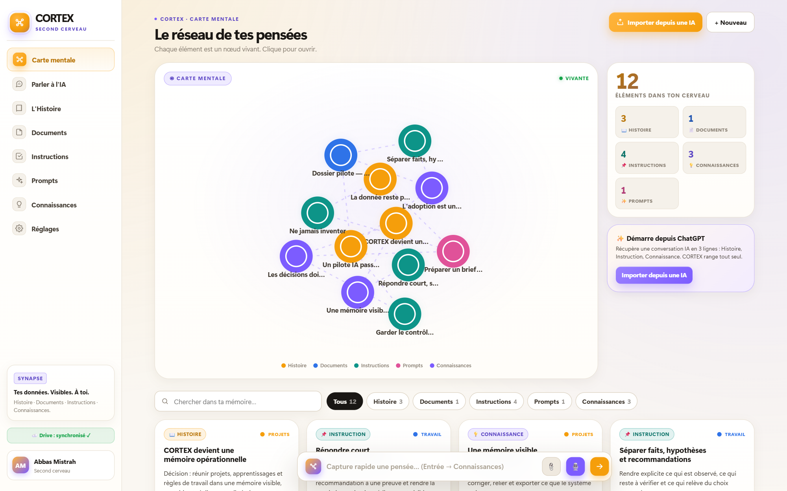
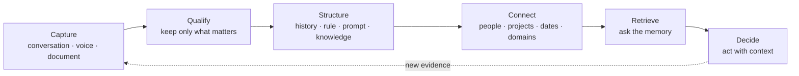
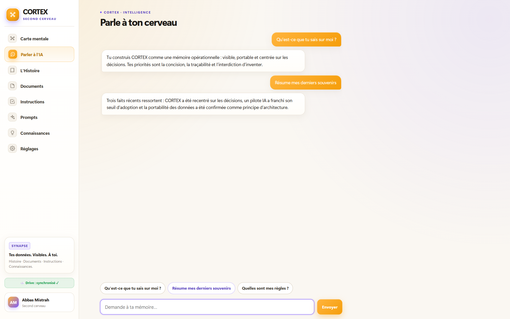
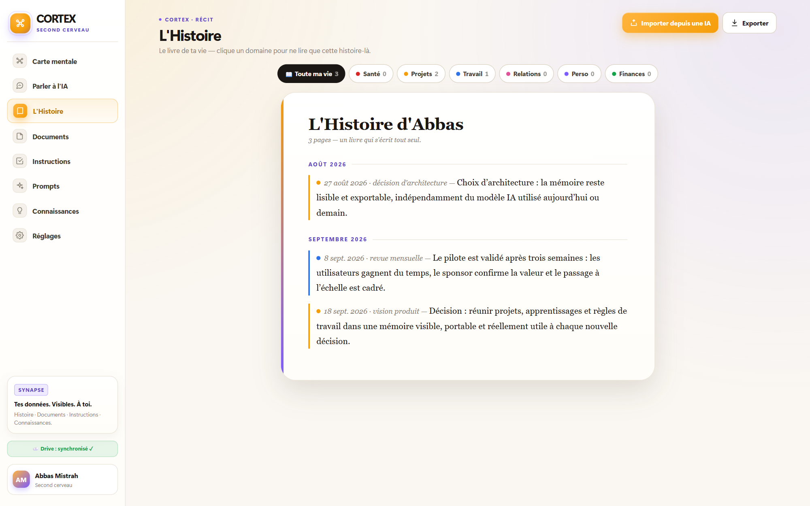
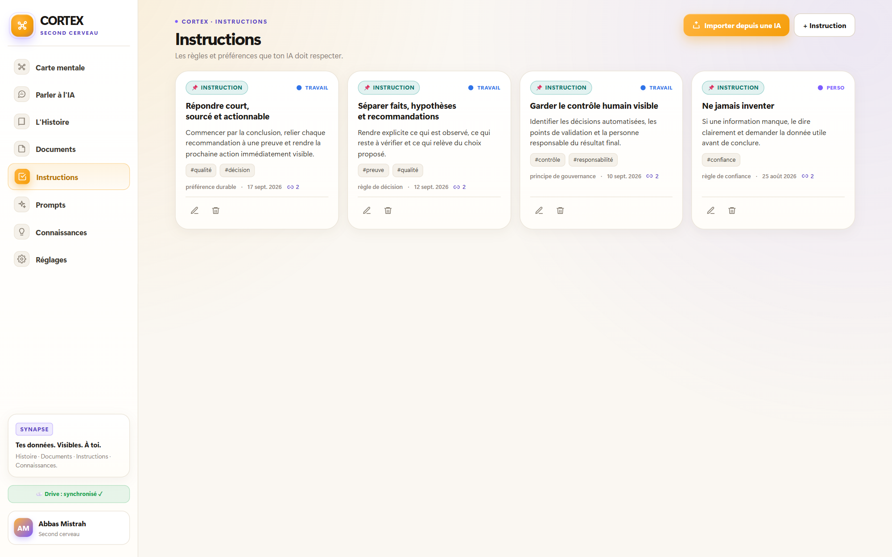
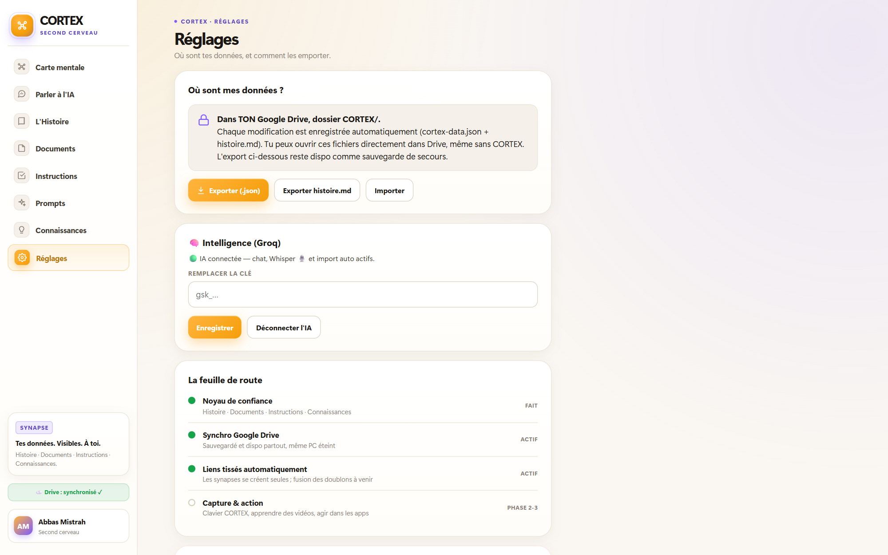
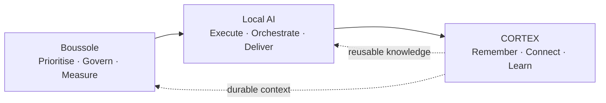
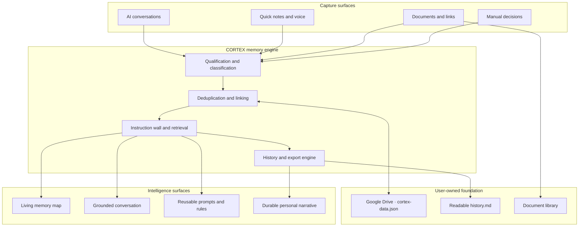

# 🧠 CORTEX

### Personal Intelligence & Memory OS

**From fragmented conversations to durable context and better decisions.**

  

> **CORTEX is a user-owned memory layer for AI-powered work.** It turns conversations, documents, voice notes, decisions and durable preferences into connected context that remains visible, searchable and reusable.

---

## Why CORTEX

Most AI conversations disappear into a timeline. The useful context is scattered, decisions lose their rationale, preferences must be repeated and every new assistant starts almost from zero.

CORTEX converts that fragmentation into a memory system:

| Memory problem | CORTEX response |
|:--|:--|
| **“Where did that decision come from?”** | Preserve the event, source, date, domain and connected evidence |
| **“What does my AI know about me?”** | Make retained context visible in a living memory map |
| **“Why must I repeat the same rules?”** | Store durable instructions separately from temporary requests |
| **“Can I question my own history?”** | Answer from the user’s memory rather than generic model recall |
| **“What happens if I change models?”** | Keep memory readable and exportable outside the AI provider |
| **“Who owns the data?”** | Store the source of truth in the user’s own Google Drive |

---

## Product system

CORTEX is organised around six connected capabilities:

| Capability | What CORTEX does | Result |
|:--|:--|:--|
| **Capture** | Ingest conversations, notes, voice and documents | Valuable context stops disappearing |
| **Structure** | Separate history, instructions, prompts, knowledge and documents | Each memory has a clear role |
| **Connect** | Link related memories across projects, dates and domains | Context becomes a network instead of a folder |
| **Retrieve** | Ground answers in the user’s own memory | The assistant recalls without pretending to know |
| **Guide** | Apply durable preferences and working rules | Collaboration improves from one session to the next |
| **Preserve** | Keep JSON, Markdown and documents readable and exportable | Memory survives tools, models and interfaces |

---

## The memory loop

The objective is not to remember everything. It is to retain the **minimum durable context** that makes the next decision faster, clearer and more reliable.

---

## Product tour

### 01 — See memory as a living system

The mental map makes retained context inspectable: every node has a type, domain, date, source and relationship to other memories.

  

### 02 — Ask what your memory actually knows

The conversation layer answers from the user’s own context. When evidence is missing, the system is designed to say so instead of inventing an answer.

  

### 03 — Turn events into a durable narrative

Decisions and milestones become a chronological, readable story that can be filtered by life domain and exported as Markdown.

  

### 04 — Make working preferences explicit

Durable instructions are kept separate from project facts. The assistant can therefore respect the way the user wants to work without confusing a temporary request with a permanent rule.

  

### 05 — Keep the source of truth readable and yours

The memory is stored in the user’s own Drive, synchronised across devices and exportable as JSON and Markdown. The model can change; the memory does not disappear with it.

  

---

## A connected transformation stack

CORTEX is the memory layer of a broader product system:

- **[Boussole](https://github.com/abbas-mistrah/boussole)** shows where transformation should go and how value is proven.
- **[Local AI](https://github.com/abbas-mistrah/lebon-ai)** gives teams an agentic workspace to execute the work.
- **CORTEX** preserves the context, rules and learning that make every new cycle stronger.

---

## Architecture

The current implementation is a dependency-light Google Apps Script web application with a browser cache for responsiveness, Drive-backed persistence and an optional model layer for classification, transcription and grounded conversation.

---

## Product principles

1. **Visibility before trust.** The user can see what is remembered, why it is connected and how to correct it.
2. **Memory is editorial, not exhaustive.** CORTEX keeps what will matter again; noise is a failure mode.
3. **Facts, rules and prompts are different objects.** Clear separation prevents context from becoming an ungoverned blob.
4. **No evidence, no invention.** Missing context must remain visible as missing context.
5. **Ownership beats lock-in.** Data stays readable outside the interface and independent of the current model.
6. **F3 by default.** Read in 5 seconds, understand in 30 seconds, act in 2 clicks.

---

## Showcase & privacy

This repository presents the product logic and selected interface views of CORTEX.

All public screenshots use:

- fictional demonstration memories and documents;
- deliberately generic projects, decisions and metrics;
- no production records, private conversations or employer data;
- no passwords, API keys or confidential identifiers.

The visuals demonstrate the real interface and product behaviour; they are not exports of a personal memory dataset.

---

## Product leadership

**Abbas Mistrah** — AI Transformation, Product & Governance  
[mistrah.com](https://mistrah.com) · [LinkedIn](https://www.linkedin.com/in/abbas-mistrah-b0b53119a) · [ORCID](https://orcid.org/0009-0009-5944-585X)

**Keep the context. Connect the learning. Make the next decision better.**

